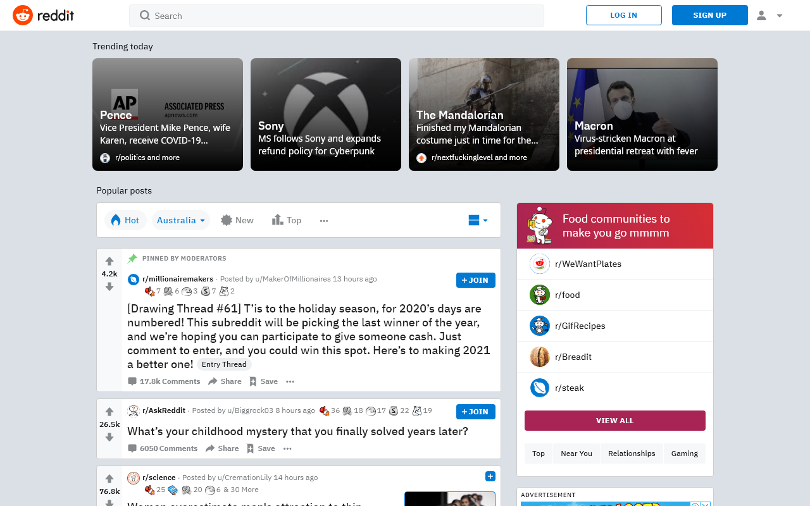
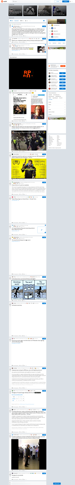

# website-screenshot-api
an api to take screenshots of sites or HTML
## setup
```
docker-compose up
```
## usage
### examples
#### normal
##### input
```
http://localhost:3000/?input=reddit.com
```
##### output

#### full page
##### input
```
http://localhost:3000/?full=true&input=reddit.com
```
##### output

#### html
##### input
```
http://localhost:3000/?input=%3Ch1%3Efoo%3C%2Fh1%3E%3Cb%3Ebar%3C%2Fb%3E
```
##### output

